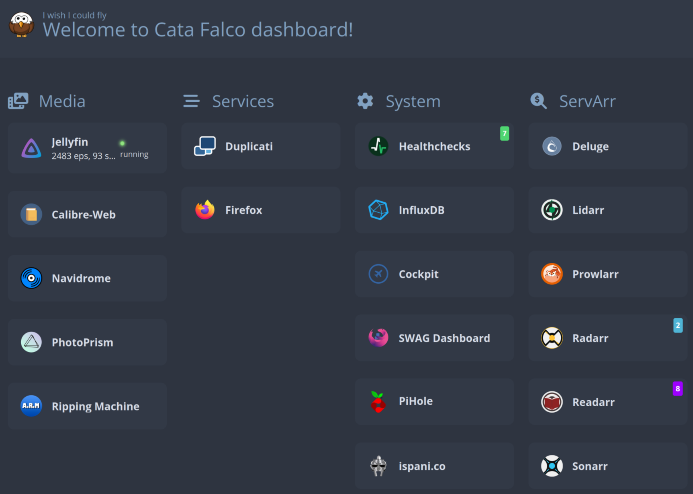

# Catafalco

An Ansible playbook that sets up an Ubuntu-based home media server/NAS with security hardening, NAS features (mergerFS, snapshot/backup solutions), media servers, email notifications, auto-updates, and more.

**Note:** Continuously being developed - don't expect it to work perfectly on the first run.



---

## Quick Reference

| Category | Details |
|----------|---------|
| **Target OS** | Ubuntu (bookworm/bookworm+) |
| **Orchestration** | Ansible 2.19+ |
| **Container Runtime** | Docker with Compose plugin |
| **File Sharing** | Samba server |
| **Networking** | Pi-hole, AdGuard DNS |
| **File Sync** | MergerFS, Rsync, Rclone, Snapraid |
| **Monitoring** | Grafana, InfluxDB, Telegraf, Prometheus, Uptime Kuma |
| **Language Support** | Zsh configuration |
| **Credential Management** | Ansible-vault (encrypted secrets) |

---

## Quick Start: Fresh Install (Ubuntu 22.04+ / Bookworm)

```bash
# Step 1: Install Ansible
sudo apt install ansible -y

# Step 2: Clone repository
git clone https://github.com/alessio/catafalco.git
cd catafalco

# Step 3: Copy and customize inventory
cp hosts_example hosts
vi hosts

# Step 4: Create host variables
mkdir -p host_vars/YOUR_HOSTNAME
vi host_vars/YOUR_HOSTNAME/vars.yml

# Step 5: Create encrypted secret variables
ansible-vault create host_vars/YOUR_HOSTNAME/secret.yml
ansible-vault edit host_vars/YOUR_HOSTNAME/secret.yml

# Step 6: Install dependencies
ansible-galaxy install -r requirements.yml

# Step 7: Add your host to the inventory
# Edit hosts file to add your hostname entry

# Step 8: Run playbook
ansible-playbook catafalco.yml -l your-host -K

# For consecutive runs (only update containers):
ansible-playbook catafalco.yml --tags="port,containers"

# Run specific tag/role:
ansible-playbook catafalco.yml -K --tag docker
```

---

## Adding a Service

1. Add service name to `containers` list in `host_vars/<YOURS>/vars.yml`
2. (Optional) Configure additional variables in `group_vars/all` or host-specific vars
3. Run:
   ```bash
   ansible-playbook catafalco.yml -K --tags containers
   ```

---

## Directory Structure

```
catafalco/
├── catafalco.yml           # Main playbook - full media server setup
├── pihole.yml              # Pi-hole focused playbook
├── nilde.yml               # Alternative/simplified configuration
├── ansible.cfg             # Ansible configuration
├── hosts_example           # Example inventory file
├── requirements.yml        # Ansible roles and collections
├── .ansible-lint           # Linting configuration
├── group_vars/             # Group-specific variables
│   ├── all/                # Global variables (timezone, colorscheme, etc.)
│   ├── dns/                # DNS-related configs
│   └── home/               # Home-specific configs
├── host_vars/              # Per-host variables
│   ├── catafalco/          # Main configuration (extensive)
│   ├── nilde/              # Alternative configuration
│   ├── pihole-one/         # Pi-hole node 1
│   └── pihole-two/         # Pi-hole node 2
├── roles/                  # ~64 Ansible roles
│   ├── System & Bootstrap
│   │   ├── system/         # System bootstrapping
│   │   └── zsh/            # Shell configuration
│   ├── NAS & Storage
│   │   ├── mergerfs/       # MergerFS filesystem
│   │   ├── mounts/         # Disk mounts
│   │   ├── hd_idle/        # Hard drive idle timeout
│   │   ├── snapraid/       # Disk array snapshot tool
│   │   └── vladgh.samba/   # Samba server
│   ├── Docker & Containers
│   │   ├── docker/         # Docker installation
│   │   ├── swag/           # SWAG reverse proxy
│   │   ├── homer/          # Docker dashboard
│   │   ├── watchtower/     # Auto-update containers
│   │   └── socket_proxy/   # Docker socket proxy
│   ├── Media Servers
│   │   ├── jellyfin/       # Media server
│   │   ├── radarr/         # Movies
│   │   ├── sonarr/         # TV shows
│   │   ├── lidarr/         # Music
│   │   ├── lazylibrarian/  # Comics/books
│   │   ├── immich/         # Photo management
│   │   ├── navidrome/      # Music server
│   │   ├── deluge/         # Torrent client
│   │   ├── handbrake/      # Transcoding
│   │   ├── calibreweb/     # E-book management
│   │   ├── arm/            # Automatic ripper
│   │   └── slskd/          # Soulseek client
│   ├── Monitoring
│   │   ├── grafana/        # Dashboarding
│   │   ├── prometheus/     # Metrics collection
│   │   ├── influxdb/       # Time-series DB
│   │   ├── telegraf/       # Collection agent
│   │   ├── mosquitto/      # MQTT broker
│   │   ├── uptime_kuma/    # Uptime monitoring
│   │   └── nmedia_prolcd/  # LCD backup viewer
│   ├── Backup & Sync
│   │   ├── duplicati/      # Encrypted backups
│   │   ├── rclone/         # Cloud file sync
│   │   ├── restic/         # Backup tool
│   │   └── nebula_sync/    # Steam cloud sync
│   ├── Services
│   │   ├── openwebui/      # LLM UI
│   │   ├── vllm/           # LLM inference
│   │   ├── nextcloud/      # Files + Office suite
│   │   ├── vaultwarden/    # Password manager
│   │   ├── actual_budget/  # Personal finance
│   │   ├── invidious/      # Privacy-friendly YouTube
│   │   ├── speedtest/      # Speed tracker
│   │   ├── seafile/        # File sync
│   │   └── miniflux/       # RSS reader
│   └── Utilities
│       ├── hd_idle/        # HDD timeout
│       ├── nvidia/         # GPU support
│       └── cockpith/       # System cockpit
├── tasks/                  # Task files
├── templates/              # Jinja2 templates
├── files/                  # Static files (scripts, icons, etc.)
├── docs/                   # Agent-agnostic knowledge base
│   ├── ansible/            # Ansible expertise, ansible-lint cheatsheet
│   └── monitoring/         # InfluxDB/Grafana deep-dive reference
└── .agents/
    └── skills/             # Cross-agent skills (Agent Skills standard)
```

### Role Structure

Each role follows a consistent structure:
```
<role-name>/
├── defaults/main.yml       # Default variables
├── vars.yml               # Host-specific overrides
├── tasks/                 # Main implementation
├── templates/             # Jinja2 templates
├── handlers/              # Service handlers
└── files/                # Static files
```

---

## Available Media Services

### ServArr (Media Download Managers)

| Role | Container | Purpose |
|------|-----------|---------|
| `radarr` | Radarr | Movies |
| `sonarr` | Sonarr | TV Shows |
| `lidarr` | Lidarr | Music |
| `lazylibrarian` | Lazy Librarian | Comics/Books |
| `prowlarr` | Prowlarr | Indexer manager |
| `deluge` | Deluge | Torrent client |

### Media Servers

| Role | Container | Purpose |
|------|-----------|---------|
| `jellyfin` | Jellyfin | All-in-one media server |
| `immich` | Immich | Photo management |
| `navidrome` | Navidrome | Music server |
| `calibreweb` | Calibre Web | E-book management |
| `handbrake` | Handbrake | Media transcoding |
| `arm` | Automatic Ripper | CD/DVD/Blu-ray ripping |

### DevOps & LLM

| Role | Container | Purpose |
|------|-----------|---------|
| `openwebui` | OpenWebUI | LLM UI |
| `vllm` | vLLM | LLM inference |

### Backup & Sync

| Role | Container | Purpose |
|------|-----------|---------|
| `duplicati` | Duplicati | Encrypted backups |
| `rclone` | Rclone | Cloud file sync |
| `restic` | Restic | Backup tool |
| `nebula_sync` | Nebula Sync | File synchronization |

### Security & Networking

| Role | Container | Purpose |
|------|-----------|---------|
| `authelia` | Authelia | SSO authentication |
| `vaultwarden` | Vaultwarden | Password manager |
| `swag` | SWAG | Reverse proxy + Let's Encrypt |

### Monitoring & Utilities

| Role | Container | Purpose |
|------|-----------|---------|
| `grafana` | Grafana | Dashboarding |
| `influxdb` | InfluxDB | Time-series database |
| `telegraf` | Telegraf | Metrics collection |
| `mosquitto` | Mosquitto | MQTT broker |
| `uptime_kuma` | Uptime Kuma | Uptime monitoring |
| `nmedia_prolcd` | LCD | Backup viewer |
| `wud` | What's Up Docker | Container update notifier |

### Productivity

| Role | Container | Purpose |
|------|-----------|---------|
| `nextcloud` | NextCloud | Files suite |
| `actual_budget` | Actual Budget | Personal finance |
| `invidious` | Invidious | YouTube alternative |
| `speedtest_tracker` | SpeedTest Tracker | Speed test logs |
| `seafile` | Seafile | File sync/sharing |
| `miniflux` | Miniflux | RSS reader |
| `cypht` | Cypht | Webmail |
| `dawarich` | Dawarich | Location history |

---

## Monitoring Stack Architecture

> **Note:** Deep InfluxDB/Grafana knowledge lives in `docs/monitoring/` (`influxdb-grafana-specialist.md` and `grafana-role-best-practices.md`). Consult these when working on dashboards, queries, or monitoring issues, and update them when new troubleshooting techniques or best practices emerge. An `ansible-lint` skill is available in `.agents/skills/`.

### Data Pipeline
```
Telegraf (host service) → InfluxDB v3 Core (Docker container: port 8181) → Grafana (Docker container: port 3000)
                           ↳ Port 8181 (FlightSQL/HTTP API)
```

**Important:** Telegraf is a **host-installed service** (not a container). It sends metrics to InfluxDB via `http://localhost:8181` (NOT the external HTTPS URL through the reverse proxy).

### Telegraf Configuration
- **Config file:** `/etc/telegraf/telegraf.conf` (managed by `roles/telegraf/files/telegraf.conf`)
- **Environment variables:** `/etc/default/telegraf` (managed by `roles/telegraf/templates/telegraf.j2`)
- **Key environment variable:** `INFLUX_URL="http://localhost:8181"` — must use local HTTP, NOT external HTTPS
- **Network interfaces monitored:** `eth*`, `enp*`, `eno*`, `lo` (configured in telegraf.conf `[[inputs.net]]` section)
- **Collected inputs:** cpu, disk, diskio, docker, intel_powerstat, mem, mqtt_consumer, net, nvidia_smi, processes, smart, swap, system, temp, upsd

### InfluxDB v3 Core
- **Container:** `influxdb` (image: `influxdb:3-core`)
- **API port:** 8181 (FlightSQL/HTTP)
- **Database:** `system-monitor`
- **Query language:** SQL only (NOT InfluxQL)
- **Query file limit:** InfluxDB v3 Core has a 432-file scan limit — always include time range constraints in queries

### Grafana Panel & Field Gotchas
- **Known Telegraf field names** (verify before querying): `temp` measurement uses field `temp` (NOT `temp_c`); `nvidia_smi` uses `temperature_gpu`; `smart_attribute` uses `raw_value` for `Temperature_Celsius` (NOT `value`). Full reference: `docs/monitoring/influxdb-grafana-specialist.md`
- **Legend labels** show `field_name tag_value`; strip the prefix with a `renameByRegex` transformation (`"regex": ".*\\s+(.*)"`, `"renamePattern": "$1"`)
- **`spanNulls: false`** for panels where gaps carry meaning (idle disks), `spanNulls: true` for continuous metrics
- **Sensor notes:** `acpitz` (ACPI thermal zone) often reports stale/constant values — not a bug; prefer SMART `Temperature_Celsius` over `nvme_composite` for NVMe temps

### Grafana Dashboards
- **Container:** `grafana` (image: `grafana/grafana:latest`)
- **Datasources:** InfluxDB_v3_SQL (default, uid: `PA6F3E0496B9A4E62`), Prometheus (uid: `PBFA97CFB590B2093`)
- **Dashboard template:** `roles/grafana/templates/provisioning.dashboards.system.json.j2`
- **Provisioned dashboards:** System Monitor, vLLM

### Grafana + InfluxDB v3 SQL Rules
1. **Use SQL syntax, NOT InfluxQL** — no `SELECT time, "field" FROM "measurement"`, use `SELECT time, field FROM measurement`
2. **No double quotes** around table names or field names in SQL queries
3. **All time_series queries MUST have `ORDER BY time`** — Grafana requires ascending time order
4. **Variable definitions need time constraints** — use `WHERE time > now() - INTERVAL 24 HOUR` to avoid InfluxDB v3 file scan limit
5. **Multi-value variables** — use `${variable:sqlstring}` format for proper SQL quoting (e.g., `interface IN (${interface:sqlstring})`)
6. **No window functions via FlightSQL** — `LAG()`, `LEAD()`, etc. may not work through Grafana's Flight SQL connector. Use Grafana's built-in transformations (`calculateField` with `mode: "rate"`) instead
7. **Time bucketing** — Grafana handles time grouping automatically when `format` is `"time_series"`. Do NOT use `GROUP BY time($__interval)`
8. **Series separation** — include the tag column in SELECT (e.g., `SELECT time, container_name, usage_percent`) for Grafana to create separate lines per tag value
9. **Dashboard default time range:** Last 30 minutes (`"from": "now-30m"`)

### Troubleshooting Grafana/InfluxDB
- Check Telegraf logs: Use MCP `mcp__remote-server__get_service_logs(service="telegraf")`
- Common error: `context deadline exceeded` — Telegraf can't reach InfluxDB (usually wrong URL)
- Common error: `invalid function 'time'` — Using InfluxQL `GROUP BY time()` instead of SQL
- Common error: `not sorted in ascending order by time` — Missing `ORDER BY time` in time_series query
- Common error: `No field named XXX` — Field name mismatch between dashboard query and actual InfluxDB schema
- Common error: **HTTP 500 from InfluxDB** — usually the 432-file scan limit (missing/insufficient time range), not a server error. Add or tighten `WHERE time > now() - INTERVAL X HOUR`
- Check InfluxDB data: Use MCP `mcp__remote-server__get_service_logs(service="influxdb")` and search for query results
- Grafana query logs: Use MCP `mcp__remote-server__get_service_logs(service="grafana")` and search for 'influx_flightsql'

### Deploy Commands
```bash
# Deploy Grafana changes
ansible-playbook catafalco.yml --tags grafana --vault-id iac@.vaults

# Restart Grafana container (mandatory after provisioning changes!)
mcp__remote-server__restart_service(service="grafana")

# Deploy Telegraf changes
ansible-playbook catafalco.yml --tags containers  # Telegraf is host-installed, not a container
```

### Remote Server Management via MCP

**IMPORTANT:** All remote server management should be done via the MCP "remote-server" tool. **DO NOT use SSH commands** to interact with the remote server. The MCP tool provides a secure proxy interface for all remote operations.

#### Available MCP Remote-Server Tools

| Tool | Purpose |
|------|---------|
| `mcp__remote-server__get_server_health` | Get overall server health (CPU, memory, disk) |
| `mcp__remote-server__list_services` | List all services in /srv/ directory |
| `mcp__remote-server__get_service_status` | Get detailed status of a specific service |
| `mcp__remote-server__get_service_logs` | Get logs for a specific service |
| `mcp__remote-server__search_service_logs` | Search service logs for a specific pattern |
| `mcp__remote-server__restart_service` | Restart a service (Docker container) |
| `mcp__remote-server__start_service` | Start a stopped service |
| `mcp__remote-server__stop_service` | Stop a running service |
| `mcp__remote-server__get_service_file` | Get contents of a file within a service directory |
| `mcp__remote-server__list_service_files` | List files in a service directory |

#### Disk Health MCP Tools (disk/SMART diagnostics)

| Tool | Purpose |
|------|---------|
| `mcp__disk-health__list_disks` | List all storage devices |
| `mcp__disk-health__get_disk_health` | Get health report for a specific disk |
| `mcp__disk-health__get_smart_attributes` | Get raw SMART attributes |
| `mcp__disk-health__get_nvme_health` | Get NVMe SMART health log |
| `mcp__disk-health__get_io_stats` | Get disk I/O statistics |
| `mcp__disk-health__get_raid_status` | Get mdadm RAID status |
| `mcp__disk-health__get_zfs_status` | Get ZFS pool status |
| `mcp__disk-health__get_full_disk_report` | Comprehensive disk health overview |
| `mcp__disk-health__query_influxdb_disk` | Query InfluxDB for historical disk metrics |

**For disk-related tasks, prefer disk-health MCP tools over manual InfluxDB queries** — they handle data source fallbacks (InfluxDB → direct smartctl) and provide formatted reports.

#### Common Remote Operations (Use MCP, NOT SSH)

```bash
# ❌ DO NOT use: ssh catafalco "sudo systemctl restart telegraf"
# ✅ USE MCP instead: mcp__remote-server__restart_service(service="telegraf")

# ❌ DO NOT use: ssh catafalco "docker restart grafana"
# ✅ USE MCP instead: mcp__remote-server__restart_service(service="grafana")

# ❌ DO NOT use: ssh catafalco "docker logs grafana"
# ✅ USE MCP instead: mcp__remote-server__get_service_logs(service="grafana", lines=100)

# ❌ DO NOT use: ssh catafalco "docker ps"
# ✅ USE MCP instead: mcp__remote-server__list_services()

# ❌ DO NOT use: ssh catafalco "journalctl -u telegraf -f"
# ✅ USE MCP instead: mcp__remote-server__get_service_logs(service="telegraf", lines=100)
```

#### Troubleshooting via MCP

```bash
# Check service health
mcp__remote-server__get_service_status(service="grafana")

# View service logs
mcp__remote-server__get_service_logs(service="influxdb", lines=200)

# Search logs for errors
mcp__remote-server__search_service_logs(service="telegraf", pattern="error", lines=500)

# Check server health
mcp__remote-server__get_server_health()

# Restart a service
mcp__remote-server__restart_service(service="grafana")
```

---

## Key Configuration Files

### Host Variables (`host_vars/<hostname>/vars.yml`)

| Setting | Description |
|---------|-------------|
| `hostname` | Hostname (usually inventory_hostname) |
| `lan_network` | Local network (e.g., `192.168.178.0/24`) |
| `username` | Non-root admin user |
| `shell` | Default shell (usually `/usr/bin/zsh`) |
| `nord_colors` | GUI colorscheme |
| `containers` | List of Docker services to deploy |
| `enable_containers` | Enable/disable containers |
| `enable_nas_stuff` | Enable NAS features (mergerFS, Samba, etc.) |
| `enable_samba` | Enable Samba file sharing |
| `mergerfs_root` | Root directory for MergerFS |
| `email` | For email notifications (SMTP) |
| `version` | Ubuntu version (e.g., `bookworm`) |

### Secret File (`host_vars/<hostname>/secret.yml`)

| Setting | Description |
|---------|-------------|
| `healthchecks_dashboard_url` | HealthChecks dashboard URL |
| `email_password` | E-mail password (for alerts) |
| `tasmota_mqtt_password` | MQTT password for Tasmota devices |
| `telegraf_mqtt_password` | MQTT password for Telegraf device |
| `docker_password` | Docker socket password |
| `julia` | SMB server address |
| `julia_samba_username` | Samba username for Julia SMB server |
| `julia_samba_password` | Samba password for Julia SMB server |

---

## Docker Address Pools

```yaml
docker_address_pools:
  - base: "172.32.0.0/16" # 256 networks of 256-2=254 peers
    size: 24
  - base: "172.33.0.0/16"
    size: 24
```

---

## Common Commands

### Running Specific Roles

```bash
# Run just Docker installation
ansible-playbook catafalco.yml -K --tag docker

# Run specific containers
ansible-playbook catafalco.yml -K --tag containers

# Run Samba configuration
ansible-playbook catafalco.yml -K --tag samba

# Dry-run (check mode)
ansible-playbook catafalco.yml --check --list-tags
```

### Tags Available

| Tag | Description |
|-----|-------------|
| `bootstrap` | Initial bootstrap (never run after initial install) |
| `never` | Never run |
| `containers` | Docker containers |
| `zsh` | Shell configuration |
| `msmtp` | Email notifications |
| `nvidia` | NVIDIA GPU support |
| `mergerfs` | Merged filesystems |
| `mounts` | Disk mounts |
| `hd-idle` | Hard drive idle timeout |
| `smartd` | SMART error reporting |
| `samba` | Samba configuration |
| `docker` | Docker engine |
| `grafana` / `monitoring` | Monitoring tools |
| `prometheus` | Prometheus metrics |
| `influxdb` / `mqtt` | Data collection systems |
| `telegraf` | Metrics aggregation |
| `ups` / `nut` | UPS monitoring |
| `servarr` | Media servarr services |
| `backup-sync` | Backup and sync tools |

---

## Playbooks

| Playbook | Description |
|----------|-------------|
| `catafalco.yml` | Full media server setup |
| `pihole.yml` | Pi-hole focused setup |
| `nilde.yml` | Alternative/simplified configuration example |

---

## Examples

### Adding a Container Service

Add to `host_vars/YOUR_HOSTNAME/vars.yml`:

```yaml
containers:
  # ... existing ...
  - your_new_service
```

Then run:
```bash
ansible-playbook catafalco.yml -K --tag containers
```

---

## Development

### Pre-commit Hooks

This project uses pre-commit hooks for linting:

```bash
# Install pre-commit
pip install pre-commit
pre-commit install

# Run manually
pre-commit run --all-files
```

### Ansible Lint

```bash
ansible-lint
```

### Requirements

- Ansible 2.19+
- Python 3.13+
- ansible-core >= 2.19.0

---

## License

DO WHAT THE FUCK YOU WANT TO PUBLIC LICENSE (WTFPL) - See [LICENSE.md](LICENSE.md) for details.

---

## Resources

- [Original inspiration - notthebee/infra](https://github.com/notthebee/infra)
- [Ansible Project](https://www.ansible.com/)
- [Ansible GitHub](https://github.com/ansible)
