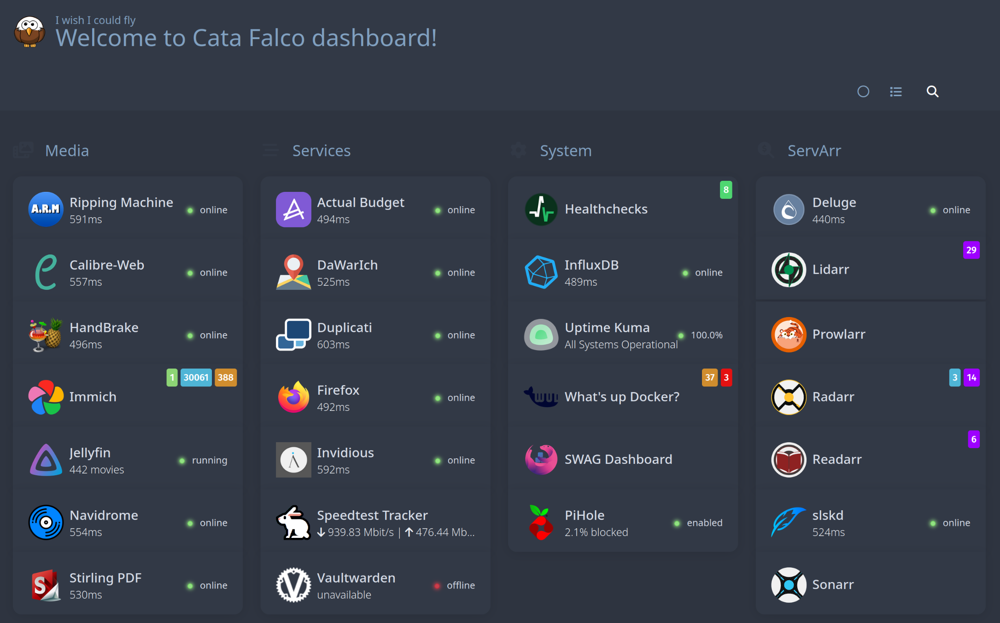

# CataFalco

An Ansible playbook that sets up an Ubuntu-based home media server/NAS with reasonable security,
auto-updates, e-mail notifications and more. 

Originally, inspired by @notthebee's [playbook](https://github.com/notthebee/infra/tree/a92a6830178ace5b2017e311afa724682984ca02),
now it's following its own track. It is a continuous work in progress, so don't expect this is
working too much as expected :-)




## Instructions
Install Ansible:
```
sudo pacman -S ansible
```

Clone this repository:
```
git clone https://github.com/elmuz/catafalco
```

Create a host varialbe file and adjust the variables:
```
cd catafalco/
mkdir -p host_vars/YOUR_HOSTNAME
vi host_vars/YOUR_HOSTNAME/vars.yml
```

Create an encrypted `secret.yml` file and adjust the variables:
```
ansible-vault create host_vars/YOUR_HOSTNAME/secret.yml
ansible-vault edit host_vars/YOUR_HOSTNAME/secret.yml
```

Add your custom inventory file to `hosts`:
```
cp hosts_example hosts
vi hosts
```

Install the dependencies:
```
ansible-galaxy install -r requirements.yml
```

Finally, run the playbook:
```
ansible-playbook run.yml -l your-host-here -K
```
The "-K" parameter is only necessary for the first run, since the playbook configures passwordless sudo for the main login user

For consecutive runs, if you only want to update the Docker containers, you can run the playbook like this:
```
ansible-playbook run.yml --tags="port,containers"
```